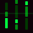

 Devlooped
============

Main site for https://www.devlooped.com. 
See also our NuGet on https://www.nuget.org/profiles/Devlooped.

## 💛 Sponsors

<!-- sponsors -->

<!-- sponsors -->
  
*[get mentioned here too](https://github.com/sponsors/devlooped)!*

